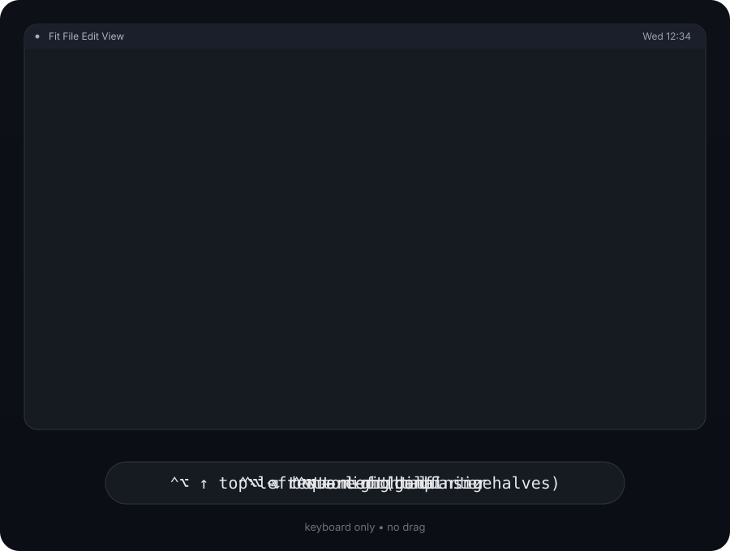
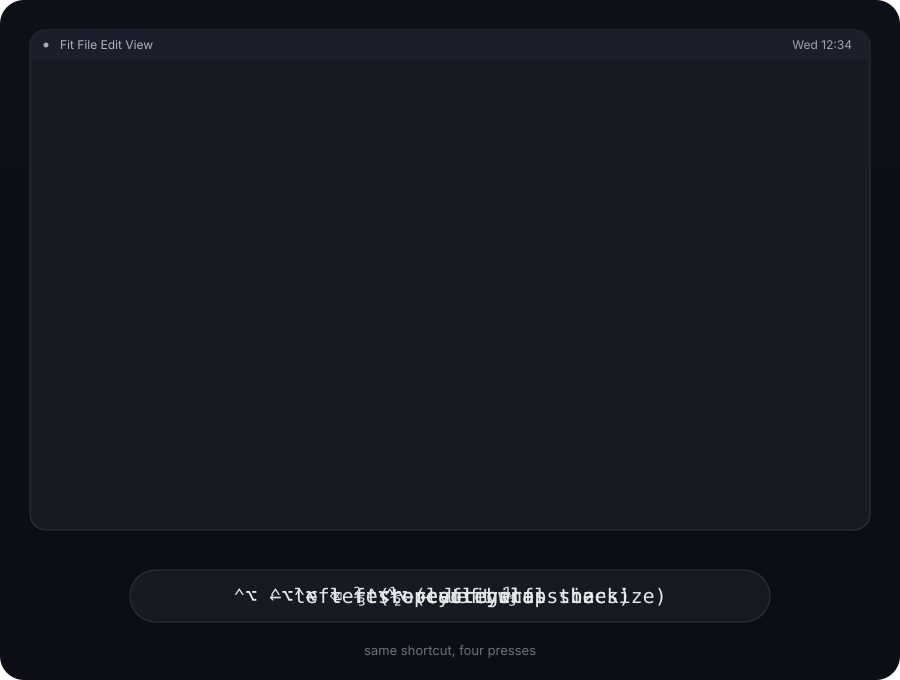

# Fit

**Keyboard-driven window snapping for macOS.** An open-source alternative to [Magnet](https://apps.apple.com/app/magnet/id441258766) that you build yourself in Xcode — designed for machines where the App Store is locked down.

[日本語版 README はこちら](README.ja.md)


## Why Fit?

Corporate Macs often can't install apps from the App Store, but they usually have Xcode. Fit is built for exactly that situation:

- **Builds with Xcode alone.** Clone, open, press ⌘R. No Apple ID, no paid developer account, no signing certificate required.
- **Zero third-party dependencies.** No Swift packages to resolve, no CocoaPods, no network access needed after cloning.
- **No network code at all.** Fit never phones home, has no analytics, and requests only the Accessibility permission. Easy to security-review: the whole app is ~2,000 lines of Swift.

## Features

- Snap the focused window with keyboard shortcuts (Magnet-compatible defaults):
  halves, quarters, thirds, two-thirds, maximize, center, restore
- Press a half shortcut repeatedly to cycle its size: ½ → ⅔ → ⅓ (works for all four halves)
- After snapping to a half, press a perpendicular half to jump to the corner: ⌃⌥← then ⌃⌥↑ → top-left quarter
- Drag a window to a screen edge or corner to snap it, with a live preview overlay
- Hold ⇧ while dragging to temporarily pause edge snapping (modifier configurable)
- Move windows to the next / previous display
- Multi-display, Dock and menu-bar aware (uses each screen's visible frame)
- Optional gap between snapped windows
- Customizable shortcuts (recorded in-app, persisted)
- Menu bar app — no Dock icon
- Launch at login

Snap to a half, then a perpendicular half to reach a corner



Repeat the same shortcut to cycle ½ → ⅔ → ⅓



## Default shortcuts

| Action | Shortcut |
|---|---|
| Left / Right half | ⌃⌥ ← / ⌃⌥ → |
| Top / Bottom half | ⌃⌥ ↑ / ⌃⌥ ↓ |
| Quarters (TL / TR / BL / BR) | ⌃⌥ U / I / J / K |
| Thirds (left / center / right) | ⌃⌥ D / F / G |
| Two thirds (left / right) | ⌃⌥ E / T |
| Maximize | ⌃⌥ Return |
| Center | ⌃⌥ C |
| Restore original size | ⌃⌥ Delete |
| Previous / Next display | ⌃⌥⌘ ← / ⌃⌥⌘ → |

All shortcuts can be changed in **Settings → Shortcuts**.

Pressing ⌃⌥ ← (or any of ⌃⌥ → ↑ ↓) repeatedly cycles the window through ½ → ⅔ → ⅓ in that direction. Moving the window by hand, or snapping anything else, restarts the cycle.

Two half-shortcuts pressed in sequence combine into a corner: ⌃⌥ ← then ⌃⌥ ↑ → top-left quarter; ⌃⌥ → then ⌃⌥ ↓ → bottom-right; and so on for the other five combinations. This works as long as the window is still where the first shortcut left it, so you can reach any of the four halves and four quarters with just the arrow keys.

Both behaviors can be turned off independently in Settings.

## Drag-to-snap zones

Drag a window until the pointer touches a screen edge, then release:

```
┌────┬─────────── maximize ───────────┬────┐
│ TL │                                │ TR │
├────┤                                ├────┤
│    │                                │    │
│ L  │                                │  R │
│    │                                │    │
├────┤                                ├────┤
│ BL │                                │ BR │
└────┴── left ⅓ ── center ⅓ ── right ⅓ ──┴─┘
```

- Left / right edge → half; top or bottom quarter of that edge → corner quarter
- Top edge → maximize
- Bottom edge → thirds

## Build & install

Requirements: **macOS 13 Ventura or later, Xcode 16 or later**.

```sh
git clone https://github.com/EitaroY/fit.git
cd fit
./scripts/install.sh
```

The install script creates a self-signed code-signing certificate (one-time keychain prompt), builds a Release copy, signs it with that certificate, installs to `/Applications`, and launches it. Because the signature stays the same across rebuilds, your Accessibility grant survives future `git pull && ./scripts/install.sh` cycles.

On first launch, Fit asks for **Accessibility** permission (System Settings → Privacy & Security → Accessibility). This is the standard macOS requirement for any app that moves other apps' windows.

Prefer plain Xcode? `open Fit.xcodeproj` and press **⌘R** — that uses ad-hoc signing, which is fine for a one-off but means every rebuild loses the Accessibility grant. See [docs/BUILDING.md](docs/BUILDING.md) for the details.

## Troubleshooting

- **Shortcuts stopped working after rebuilding.** You built with plain Xcode (ad-hoc signing). Either use `./scripts/install.sh` (recommended — signatures stay stable across rebuilds), or remove Fit from the Accessibility list (−) and re-add it every time.
- **A window won't resize exactly.** Some apps enforce minimum sizes or grid increments (e.g. terminals); Fit gets as close as the app allows.
- **Native full-screen windows** (green button spaces) can't be snapped — leave full screen first.

## Project layout

```
Fit/                 App source
  App/               Entry point, app delegate, status item
  Core/              Pure logic: snap geometry, drag zones (unit-tested, no AppKit)
  Windowing/         Accessibility API wrappers, screen coordinate handling
  Input/             Global hotkeys (Carbon), drag-to-snap monitor
  UI/                Settings window, onboarding, snap preview overlay
  Support/           Settings store, login item
Tests/FitCoreTests/  Unit tests for the pure core (`swift test`)
docs/DESIGN.ja.md    Detailed design document (Japanese)
```

Run the core unit tests without Xcode's GUI:

```sh
swift test
```

## Roadmap

- Sixths for large displays
- Per-app ignore list
- Localized UI (Japanese)

## License

[GPL-3.0](LICENSE). Copyright © 2026 Eitaro Yamatsuta.

Fit is dual-licensed: this repository is GPLv3, and the copyright holder also distributes an official build through the Mac App Store under Apple's standard terms. Contributions are accepted under the CLA described in [CONTRIBUTING.md](CONTRIBUTING.md), which is what makes the App Store build possible.
